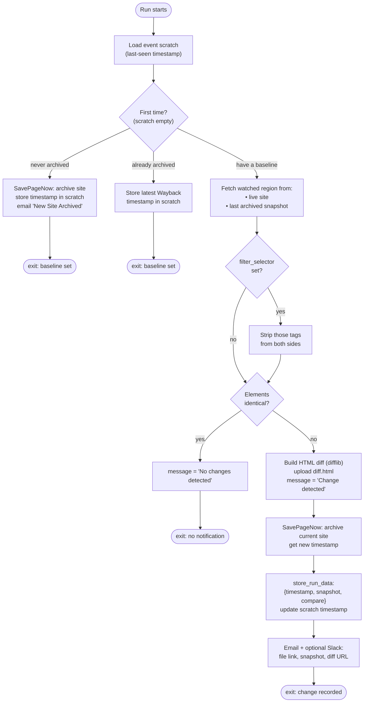

# The Klaxon Add-On script

The program that actually observes a site. It lives in [`MuckRock/Klaxon`](https://github.com/MuckRock/Klaxon) as a single [`main.py`](https://github.com/MuckRock/Klaxon/blob/main/main.py), with its parameter schema in [`config.yaml`](https://github.com/MuckRock/Klaxon/blob/main/config.yaml). It is a standard **DocumentCloud Add-On**: it subclasses `AddOn` from the [`python-documentcloud`](https://github.com/MuckRock/python-documentcloud) SDK and runs **inside GitHub Actions**, one process per run.

## How it's invoked

A run is triggered by a `repository_dispatch` event that DocumentCloud fires (see
[documentcloud.md](./documentcloud.md#dispatch-addonevent-dispatch--dispatch-task--addon-dispatch)).
The reusable workflow at
[`MuckRock/documentcloud-addon-workflows`](https://github.com/MuckRock/documentcloud-addon-workflows)
(`.github/workflows/run-addon.yml`), referenced by Klaxon's own
[`run-addon.yml`](https://github.com/MuckRock/Klaxon/blob/main/.github/workflows/run-addon.yml),
does the harness work:

1. Reads the GitHub event payload from `$GITHUB_EVENT_PATH`.
2. Echoes the run id (`client_payload.id`) as a step — this is the step
   DocumentCloud later reads back to match the run to its uuid.
3. Checks out the Add-On repo, sets up Python, and `pip install -r requirements.txt`.
4. Extracts the whole `client_payload` as JSON and runs **`python main.py "$PAYLOAD"`**.
5. Passes the Internet Archive credentials as the env vars **`KEY`** and
   **`TOKEN`** (from the repo's `SAVEPAGENOW_ACCESS_KEY` /
   `SAVEPAGENOW_SECRET_KEY` secrets), plus DocumentCloud auth.

The SDK's base class parses that payload argument into `self.data` (the
parameters), `self.id` (the run uuid), `self.event_id`, `self.user_id`,
`self.org_id`, and an authenticated API `self.client`. The token from the payload
lets the client act **as the user who owns the alert**.

`run-addon.yml` sets a **15-minute timeout** on the job; a run that exceeds it is
cancelled (which DocumentCloud sees as a failure for auto-disable purposes).

## Inputs

From `config.yaml` (synced into the Add-On's `parameters` on DocumentCloud), the
parameters — i.e. `self.data` — are:

| Parameter | Required | Meaning |
| --- | --- | --- |
| `site` | yes | The URL to monitor. |
| `selector` | yes | CSS selector for the region to watch. `*` means the whole page. |
| `filter_selector` | no | An HTML tag to **strip out** before comparing (e.g. `a` to ignore links). |
| `title` | no | A descriptive name for this alert (display only). |
| `slack_webhook` | no | If set, notifications are also POSTed to this Slack webhook. |

Cross-run memory comes from the event's `scratch`, read via
`self.load_event_data()` (returns `None` for runs with no `event_id`). Klaxon
stores a single key there: `{"timestamp": "<14-digit Wayback timestamp>"}`.

## What a run does

Entry point: `main()` → `monitor_with_selector(site, selector)`.

### First run (establishing a baseline)

The very first run of an alert has empty `scratch`, so it doesn't compare
anything — it just establishes a starting point:

- **If the site has never been on the Wayback Machine:** Klaxon archives it via
  SavePageNow, stores that snapshot's timestamp in `scratch`, emails the user a
  "New Site Archived" notice, and exits.
- **If the site is already archived:** Klaxon records the most recent existing
  snapshot's timestamp in `scratch` and exits.

Because DocumentCloud dispatches a run immediately when an alert is created (see
[documentcloud.md](./documentcloud.md#addon_events--alerts)), this baseline is set
right at creation time. Comparisons begin on the *next* run.

### Subsequent runs (detecting change)

1. **Resolve the old version.** Build a raw-HTML Wayback URL from the timestamp in
   `scratch` (`https://web.archive.org/web/<ts>id_/<site>`).
2. **Fetch both sides.** Pull the `selector` region from the archived snapshot and
   from the live site, using `requests` + BeautifulSoup.
3. **Optional filtering.** If `filter_selector` is set, recursively strip those
   tags from both sides before comparing (to ignore trivial/noisy elements).
4. **Compare.** If the selected elements are byte-for-byte equal after
   prettifying, set the message to `"No changes detected on the site"` and exit —
   **no notification.**
5. **On a difference:**
   - Set the message to `"Change detected"`.
   - Build a side-by-side HTML diff with `difflib.HtmlDiff()`, write it to
     `diff.html`, and `upload_file()` it (→ S3 via a presigned URL; the
     downloadable `file_url` is fetched back from the run).
   - **Archive the current site** with SavePageNow (with retry/backoff via
     `tenacity`) to get a fresh snapshot + timestamp.
   - **Persist results:** update `scratch.timestamp` to the new snapshot (so the
     next run diffs against this one) and `store_run_data({timestamp, snapshot,
     compare})` — where `snapshot` is the new Wayback URL and `compare` is the
     Wayback **visual diff** URL between the old and new timestamps.
   - **Notify:** email the user (and POST to Slack if configured) with the diff
     file link, the new snapshot URL, and the comparison URL.

There's an edge case: if SavePageNow returns the *same* timestamp as before
(can happen with rapid re-archiving), the run exits without a spurious alert; and
if archiving fails entirely, it falls back to the latest available Wayback
snapshot.

## Outputs and where they go

| Output | Mechanism | Surfaced in the UI as |
| --- | --- | --- |
| `message` (`"Change detected"` / `"No changes detected on the site"`) | `set_message()` → PATCH `addon_runs/<uuid>/` | The `message` filter that separates "changes" from no-ops. |
| `data = {timestamp, snapshot, compare}` | `store_run_data()` → PATCH `addon_runs/<uuid>/` | "View changes" (`compare`), snapshot link, change time. |
| `diff.html` | `upload_file()` → S3 | The downloadable diff (`file_url`, login required). |
| Updated `scratch.timestamp` | `store_event_data()` → PATCH `addon_events/<id>/` | Not shown; it's the cross-run memory. |
| Email | `send_mail()` → POST `messages/` | Delivered to the account email (outside the extension). |
| Slack message | direct POST to the user's webhook | Delivered to Slack (outside the extension). |
| Internet Archive snapshots | SavePageNow / Wayback APIs | The archived pages the snapshot/diff links point to. |

## Notes & constraints

- **Rate limits.** Klaxon depends on SavePageNow (Internet Archive). Even
  authenticated, captures are limited (~6/min); the MuckRock account has a higher
  limit. Heavy hourly usage without filters can hit limits — hence `tenacity`
  backoff. (See the Add-On README's rate-limiting notes.)
- **Whole-page watches are noisy.** Watching `*` (or, from the extension, an empty
  selector) compares the entire page and can alert on trivial changes; a tighter
  `selector` and/or `filter_selector` reduces noise.
- **Self-forking.** The Add-On README documents running your own fork (your own IA
  credentials, your own GitHub secrets, re-pointing the legacy bookmarklet). Not
  relevant to the hosted MuckRock product, but it explains why the script is
  configurable the way it is.
- **The legacy bookmarklet.** `MuckRock/Klaxon` still contains a `bookmarklet/`
  (the older "Add to Klaxon" entry point that redirected into DocumentCloud's
  generic Add-On dispatch form). The browser extension in this repo is its
  successor; the bookmarklet path is not part of the extension flow.
</content>
