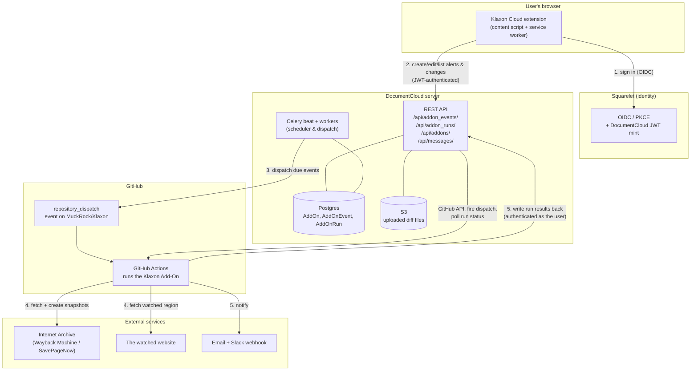

# Architecture

This page describes the four moving parts, how they connect, and the shared data
model they all read and write. For step-by-step traces of specific flows, see
[data-flow.md](./data-flow.md).

## System diagram



The numbered edges correspond to the lifecycle in [data-flow.md](./data-flow.md).

## The four parts

### 1. Browser extension — "Klaxon Cloud" (this repo)

A Chrome/Firefox Manifest V3 extension (Svelte 5 + Vite + TypeScript) that
injects a sidebar into the current page. The user hovers/clicks/drags to pick a
DOM region; the extension builds a CSS selector for it and lets the user save it
as an **alert** with a schedule and notification options. It also lists the
user's existing alerts for the current site and their recent changes.

It is purely a **client of the DocumentCloud API**. It holds no data of its own
beyond auth tokens; everything it shows is fetched from DocumentCloud. See
[extension.md](./extension.md).

### 2. DocumentCloud server

The system of record. It:

- stores the **Add-On** registration (Klaxon's name, GitHub repo, parameter
  schema), each user's **Add-On Events** (alerts), and every **Add-On Run**
  (execution);
- exposes the REST API the extension uses (`/api/addon_events/`,
  `/api/addon_runs/`, `/api/addons/`, `/api/messages/`);
- runs the **scheduler** (a periodic Celery task) that decides which events are
  due and **dispatches** them;
- talks to GitHub to fire each run and to poll its status;
- stores the HTML diff files the Add-On uploads (on S3) and serves them back.

See [documentcloud.md](./documentcloud.md).

### 3. Klaxon Add-On script

The Python program in [`MuckRock/Klaxon`](https://github.com/MuckRock/Klaxon)
(`main.py`). It runs **inside GitHub Actions**, one invocation per run. It reads
its parameters (site, selector, etc.) from the dispatch payload, compares the
watched region of the live site against the most recent Internet Archive
snapshot, and — when they differ — archives a new snapshot, sends notifications,
and writes the results back to the DocumentCloud API. See [addon.md](./addon.md).

### 4. Squarelet (identity)

MuckRock's shared OIDC identity provider. The extension authenticates the user
against Squarelet (Authorization Code + PKCE), then exchanges the resulting OIDC
token for a **DocumentCloud JWT**, which is what the DocumentCloud API actually
accepts. Squarelet also issues the refresh tokens DocumentCloud uses to let the
Add-On act *as the user* when it calls back into the API. See the Auth section of
[extension.md](./extension.md).

## Shared data model

Three Django models in DocumentCloud's `addons` app carry essentially all of the
state. (Field lists are summarized; see
[`documentcloud/addons/models.py`](https://github.com/MuckRock/documentcloud/blob/master/documentcloud/addons/models.py)
for the authoritative definitions.)

### `AddOn` — the program

One row for Klaxon itself. Created/maintained by MuckRock, not by end users.

| Field | Meaning |
| --- | --- |
| `name` | The Add-On's name (also used as the GitHub `repository_dispatch` event type). |
| `repository` | The GitHub repo, e.g. `MuckRock/Klaxon`. |
| `parameters` | The JSON-schema parameter spec, synced from the repo's `config.yaml`. Defines `site`, `selector`, `filter_selector`, `title`, `slack_webhook`. |
| `github_account` / `github_installation` | How DocumentCloud authenticates to GitHub to dispatch runs. |
| `default`, `featured`, `access` | Visibility/availability flags. |

In the extension this is referenced only by numeric id, via the
`MUCKROCK_KLAXON_ID` build-time env var. **⚠️ Unclear:** whether a user must
explicitly "activate"/install the Klaxon Add-On before they can create events for
it, or whether it being a default/public Add-On is sufficient. See
[open-questions.md](./open-questions.md).

### `AddOnEvent` — the alert

One row per saved alert. This is what the extension creates, lists, edits, and
disables.

| Field | Meaning |
| --- | --- |
| `addon` | FK to the Klaxon `AddOn`. |
| `user` | The user who created the alert. |
| `parameters` | The user-supplied config: `{ site, selector, filter_selector?, title?, slack_webhook? }` (Klaxon's `KlaxonParams`). |
| `event` | The schedule, as an integer: `0 disabled, 1 hourly, 2 daily, 3 weekly` (also `4 upload`, unused by Klaxon). |
| `scratch` | A JSON blob the Add-On uses to **persist state between runs** — for Klaxon, the timestamp of the last-seen Internet Archive snapshot, e.g. `{ "timestamp": "20230703130357" }`. |

The `scratch` field is the crucial piece of cross-run memory: it's how a
scheduled run knows which archived snapshot to diff against.

### `AddOnRun` — the change (and every non-change too)

One row per execution of the Add-On.

| Field | Meaning |
| --- | --- |
| `addon`, `event`, `user` | What ran, which alert triggered it, for whom. `event` is null for one-off manual runs. |
| `uuid` | The run's identifier. Passed into the Add-On as `id`; the Add-On uses it to address itself in the API (`addon_runs/{uuid}/`). |
| `run_id` | The GitHub Actions workflow run id, discovered after dispatch (see [documentcloud.md](./documentcloud.md#tracking-the-github-run)). |
| `status` | `queued → in_progress → success / failure / cancelled`, mirrored from the GitHub Actions run. |
| `message` | A human-readable progress/result message set by the Add-On. Klaxon sets `"Change detected"` or `"No changes detected on the site"`. **The extension filters on this** to show only changes. |
| `data` | Arbitrary per-run JSON written by the Add-On. Klaxon stores `{ timestamp, snapshot, compare }` — the new snapshot's timestamp, the Wayback snapshot URL, and the Wayback visual-diff URL. |
| `file_name` / file endpoints | The uploaded `diff.html`, stored on S3 and served via a presigned URL. |
| `dismissed` | Scheduled Klaxon runs are created with `dismissed=True` so they don't clutter the generic DocumentCloud Add-On run list. |

### How the names line up

```
AddOn      ── "Klaxon", the program (one row, MuckRock-owned)
  │
  ├── AddOnEvent  ── an "alert"  (one per watched URL per user; holds the schedule + scratch memory)
  │      │
  │      └── AddOnRun ── a single execution; surfaced as a "change" when it detected a difference
```

## Boundaries and responsibilities at a glance

| Concern | Owned by |
| --- | --- |
| Picking a DOM region / building a selector | Extension |
| Authenticating the user | Extension ↔ Squarelet |
| Storing alerts & run history | DocumentCloud (Postgres) |
| Deciding what's due & dispatching | DocumentCloud (Celery) |
| Running the observation, diffing, notifying | Klaxon Add-On (in GitHub Actions) |
| Creating/serving Internet Archive snapshots | Klaxon Add-On ↔ Internet Archive |
| Storing/serving the HTML diff file | DocumentCloud (S3) |
| Sending email / Slack | Klaxon Add-On (email via DocumentCloud `messages/` API; Slack direct to webhook) |
</content>
