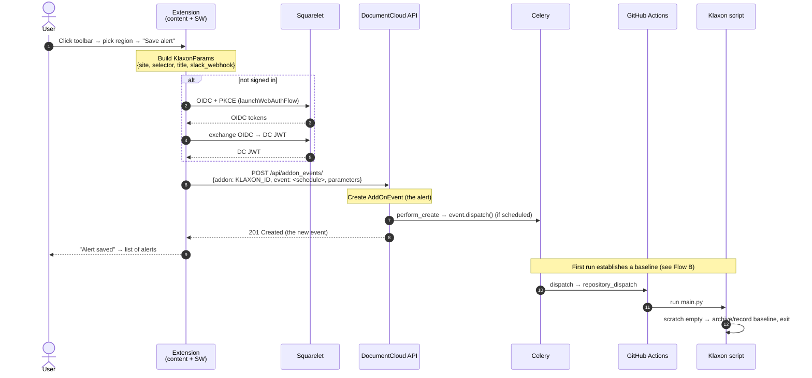
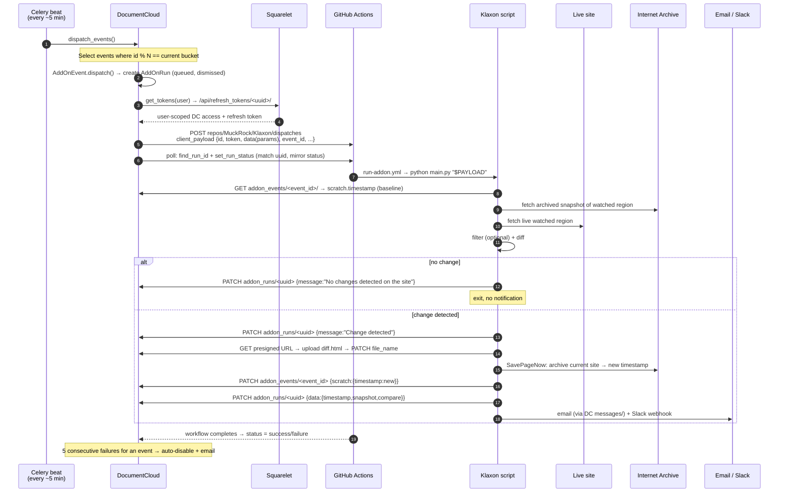

# End-to-end data flow

This is the "map out how data moves between each part" document the
[issue](https://github.com/MuckRock/Klaxon-Cloud/issues/28) asks for. It traces
three flows step by step:

- [Flow A — Creating an alert](#flow-a--creating-an-alert)
- [Flow B — A scheduled run (the steady state)](#flow-b--a-scheduled-run)
- [Flow C — Viewing alerts and changes](#flow-c--viewing-alerts-and-changes)

For the actors and the data model, read [architecture.md](./architecture.md)
first. Naming reminder: **alert = `AddOnEvent`**, **change = `AddOnRun` that
detected a difference**.

## Flow A — Creating an alert

The user is on a page they want to watch, opens the Klaxon sidebar, picks a
region, and saves.



Data created and where it lives:

| Step | Data | Lives in |
| --- | --- | --- |
| Pick region | CSS selector string | Extension memory only |
| Resolve URL/title | canonical URL (`og:url` → `canonical` → `location.href`), page title | Extension memory only |
| Save | `AddOnEvent { addon, user, parameters:{site,selector,title?,slack_webhook?}, event:<1/2/3> }` | **DocumentCloud (Postgres)** |
| Immediate first run | `AddOnRun` (queued) + a `repository_dispatch` | DocumentCloud + GitHub |

Key points:

- The extension **only** sends `addon`, `event` (the schedule integer), and
  `parameters`. The `user` is taken from the JWT server-side.
- Creating a scheduled alert triggers an **immediate first run** (DocumentCloud's
  `perform_create` calls `event.dispatch()`), which sets the monitoring baseline
  rather than detecting a change.
- If the user wasn't signed in, the save is **deferred** through the `signIn`
  view and resumed afterward, so the typed details aren't lost.

## Flow B — A scheduled run

The steady state: DocumentCloud's scheduler fires a due alert, the Add-On runs in
GitHub Actions, and the result flows back. This is where the four parts actually
exchange data.



What moves between each part:

1. **Scheduler → run record.** `dispatch_events` picks due events by the
   `id % bucket` rule (see
   [documentcloud.md](./documentcloud.md#scheduling-dispatch_events)) and creates
   a `queued`, `dismissed=True` `AddOnRun`.
2. **DocumentCloud → Squarelet.** DocumentCloud fetches **user-scoped tokens** so
   the Add-On can later authenticate to the API *as the alert's owner*.
3. **DocumentCloud → GitHub.** A `repository_dispatch` carries the run uuid, the
   user tokens, API base URLs, the alert's `parameters` (as `data`), and the
   **`event_id`**. DocumentCloud then polls GitHub to learn the workflow `run_id`
   (by matching the uuid echoed as a workflow step) and mirror the run status.
4. **Add-On ← event scratch.** The script reads `scratch.timestamp` from the
   event — the last-seen snapshot — to know what to diff against.
5. **Add-On ↔ live site + Internet Archive.** It fetches the watched region from
   both the live site and the archived snapshot, optionally strips
   `filter_selector` tags, and diffs.
6. **Add-On → DocumentCloud (results).** Everything the user eventually sees is
   written here via PATCHes to `addon_runs/<uuid>/` (message, `data`, uploaded
   diff) and `addon_events/<event_id>/` (updated `scratch`).
7. **Add-On → notifications.** Email goes out through DocumentCloud's `messages/`
   API (to the account email); Slack goes straight to the user's webhook.
8. **GitHub → DocumentCloud (status).** The final workflow conclusion becomes the
   run's `status`. Five straight failures auto-disable the alert.

The **memory loop** is the important invariant: each change-detecting run
advances `scratch.timestamp` to the snapshot it just created, so the next run
diffs against "the last time we saw a change," not against the original baseline.

## Flow C — Viewing alerts and changes

Read-only. The extension fetches from DocumentCloud and renders.

```mermaid
sequenceDiagram
    autonumber
    actor User
    participant Ext as Extension
    participant DC as DocumentCloud API

    User->>Ext: Open sidebar on a site
    par alerts for this site
        Ext->>DC: GET addon_events/?addon=KLAXON_ID&domain=<origin>&expand=addon
        DC-->>Ext: events (alerts)
    and recent changes for this site
        Ext->>DC: GET addon_runs/?addon=KLAXON_ID&domain=<origin>&message=Change detected&expand=addon,event
        DC-->>Ext: runs (changes)
    end
    Ext->>Ext: Join each alert to its latest change; sort newest-first
    Ext-->>User: List of alerts + "Changed <time>" + "View changes"

    User->>Ext: Open one alert (viewAlert)
    Ext->>DC: GET addon_runs/?addon=KLAXON_ID&site=<exact>&event=<id>&message=Change detected
    DC-->>Ext: that alert's changes
    Ext-->>User: details + recent changes (snapshot / diff links)
```

How the pieces map to the UI:

- **"Alerts on this site"** = `addon_events` filtered by `domain` (origin), so
  every alert for the site shows regardless of path.
- **"Changes"** = `addon_runs` filtered by `message="Change detected"`, which
  excludes the many no-op runs. The home view joins each alert to its most recent
  change to show "Changed <time>".
- **"View changes"** links to `run.data.compare` (the Wayback visual diff);
  snapshot links use `run.data.snapshot`; the run time is `created_at`.
- **The downloadable HTML diff** (`file_url`) requires being logged into
  DocumentCloud and is served via a presigned URL that eventually expires.
- **Editing/disabling** an alert is a `PATCH addon_events/<id>/` — disabling sets
  `event: 0`; reactivating sets it back to a schedule. Bulk-disable in
  `listAlerts` issues one PATCH per selected alert.

## The data, summarized as one loop

```
Extension ──create alert──▶ AddOnEvent (parameters + schedule)         [DocumentCloud]
                                  │
DocumentCloud scheduler ──due?──▶ AddOnRun + repository_dispatch       [DocumentCloud → GitHub]
                                  │
GitHub Actions ───────────run────▶ Klaxon script                       [GitHub]
                                  │   reads scratch, diffs live vs archive
                                  ▼
        ┌───── writes back ───────┴───────────────────────────────┐
        │ AddOnRun.message/.data/.file   AddOnEvent.scratch         │   [→ DocumentCloud]
        │ email (messages/)              Slack webhook              │
        └───────────────────────────────┬───────────────────────────┘
                                          ▼
Extension ◀──read changes── AddOnRun (message="Change detected", data.compare/snapshot)  [DocumentCloud]
```
</content>
